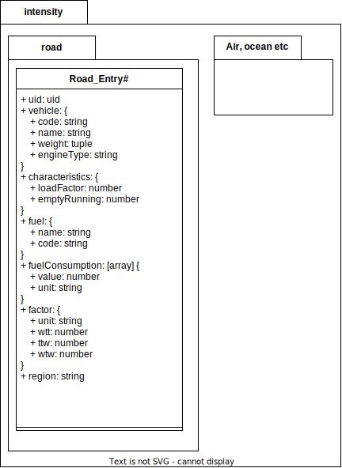

= Documentation on how to use the GLEC Framework

This document states how we used the GLEC Framework and what we did to extract data from it.
The framework version used during creation of this document is `+GLEC_Framework_July_2022+`.

== Emission Factors
There are several types of emission factors spread over the whole pdf document. As there is no other data source available, we decided to extract the data from the pdf document. In the following sections we explain how to do it for the different types of emission factors.

=== Fuel emission factors
TODO:

=== Intensity Emission Factors for Road Transport
The road intensity emission factors are being used when calculating the emissions for road transport and there is no data available on the exact amount of fuel used. The intensity emission factors are based on the type of vehicle and the characteristics of the transport. The intensity emission factors are given in gCO2e/tkm. In the GLEC framework they can be found on p. 103-31.
We came up with the following schema to store the data:

The factors for the North American values are using a special format (table 40).
The column "SmartWay Category" has been mapped to the characteristics object in the schema for all rows, expect the "Van (<3.5 t)" category, which has been mapped to the vehicle object.

The rest of the GLEC chapter covers the factors for Europe and South America. We extracted them from the pages 104 to 107 from both the tables and the paragraphs (which also contain some of the factors). We decided to create a separate factor entry per region and per emission intensity factor. This leads to some duplicated data but makes it easier maintain the data and to use it in the calculation.

As described further in the Framework we took these factors and multiplied the emission and fuel consumption factors by either 1.13 or 1.22 (depending on the Gross Vehicle Weight (GVW)) for Asia and Africa.

To also cover temperature controlled transport, we copied all of these factors (Europe, South America, Asia and Africa) and added a boolean flag to the object to indicate if the transport is temperature controlled or not. Then the factors were multiplied by 1.13 and 1.22, depending on the GVW.
