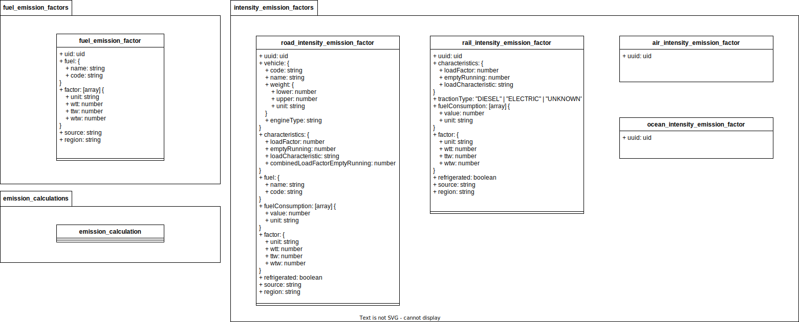

= Documentation on how to use the GLEC Framework

This document states how the GLEC Framework document has been used and how the required data was extracted from it.
The framework version used during creation of this document is `+GLEC_Framework_July_2022+`.

== Emission Factors
The extraction of the emission factors was one of the trickiest parts of the project. The framework is a pdf document and the data is spread over the whole document. There is no other data source available, so it was decided to extract the data from the pdf document. Also the data is not always in a structured format, so it was required to be extracted from tables and paragraphs.

Every factor provides three different values, the well to tank (WTT), the tank to wheel (TTW) and the well to wheel (WTW) value. The WTT value is the emission factor for the production of the fuel, the TTW value is the emission factor for the combustion of the fuel and the WTW value is the sum of both.

The following sections explain how the extraction was done for the different types of emission factors.

=== Fuel emission factors
The fuel emission factors are being used when primary data is available, i.e. the exact amount of fuel used is known. The fuel emission factors are given in kgCO2e/kg fuel. In the GLEC framework they can be found on p. 85-91. The values are based on the type of fuel and the region.

=== Intensity Emission Factors for Road Transport
The road intensity emission factors are being used when calculating the emissions for road transport and there is no data available on the exact amount of fuel used. The intensity emission factors are based on the type of vehicle, the characteristics of the transport and the region. The intensity emission factors are given in gCO2e/tkm. In the GLEC framework they can be found on p. 103-31.
The schema these factors are being stored in can be found in the database schema section.

The factors for the North American values are using a special format (table 40).
The column "SmartWay Category" has been mapped to the characteristics object in the schema for all rows, expect the "Van (<3.5 t)" category, which has been mapped to the vehicle object.

The rest of the GLEC chapter covers the factors for Europe and South America. We extracted them from the pages 104 to 107 from both the tables and the paragraphs (which also contain some of the factors). We decided to create a separate factor entry per region and per emission intensity factor. This leads to some duplicated data but makes it easier maintain the data and to use it in the calculation.

As described further in the Framework we took these factors and multiplied the emission and fuel consumption factors by either 1.13 or 1.22 (depending on the Gross Vehicle Weight (GVW)) for Asia and Africa.

To also cover temperature controlled transport, we copied all of these factors (Europe, South America, Asia and Africa) and added a boolean flag to the object to indicate if the transport is temperature controlled or not. Then the factors were multiplied by 1.13 and 1.22, depending on the GVW.

=== Intensity Emission Factors for Road Transport
The rail intensity emission factors are being used when calculating the emissions for rail transport and there is no data available on the exact amount of fuel used. The intensity emission factors are based on the type of traction type of the transport, the characteristics of the transport and the region. The intensity emission factors are given in gCO2e/tkm. In the GLEC framework they can be found on p. 101-102.

For the North American region, there is just one default value provided, for diesel traction. This value is being used for all rail transport in North America. For the European region, there are different values for the different traction types and characteristics. They were extracted from the pages 101 and 102 from both the tables and the paragraphs (which also contain some of the factors). The schema these factors are being stored in can be found in the database schema section.

=== Database schema
The database schema was created to contain all the considerations made in the GLEC Framework. The schema is shown in the following diagram:

